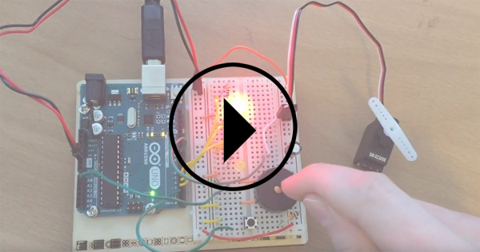

# Arduino Uno Starter Kit

I had wanted to learn about circuitry for a while now and was pretty excited when my roommate gave me the arduino starter kit. I made some slight modifications to the lessons amd skipped some of the cosmetic work. Now I'm confident to modify electronics, use logic to control actuators, and work with any type of sensor. Next, I'd like to look into making some custom IoT devices for fun & productivity. 

